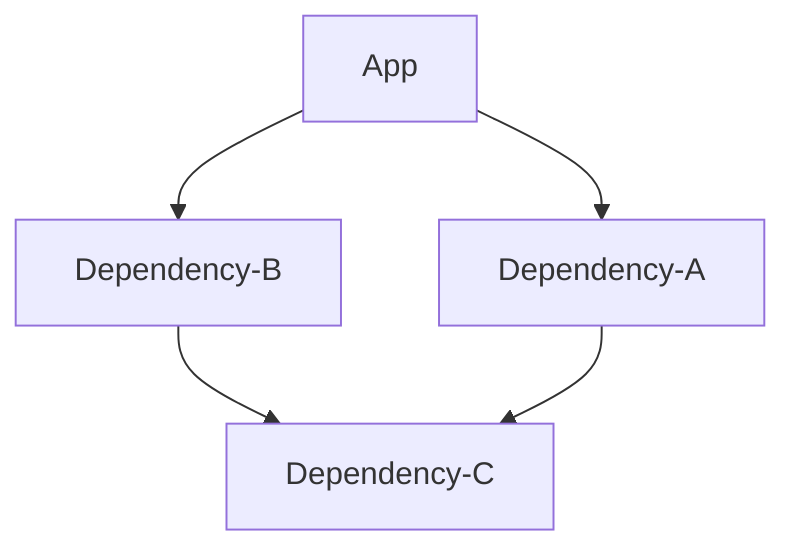
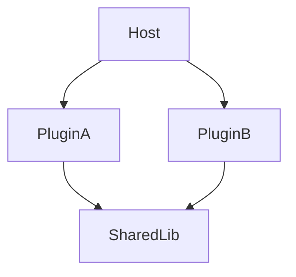

[](https://www.nuget.org/packages/FactoryGenerator/)
[](https://www.nuget.org/packages/FactoryGenerator.Attributes/)
[](https://www.nuget.org/packages/FactoryGenerator.Extensions.AspNetCore/)
[](https://github.com/westermo/FactoryGenerator/actions)
[](https://github.com/westermo/FactoryGenerator/blob/develop/LICENSE)

FactoryGenerator is an IoC container that uses [Roslyn](https://github.com/dotnet/roslyn) to prepare a container for consumption at compile-time. Inspired by, but having little in common
with [Autofac](https://autofac.org/) beyond syntax choices.

## Features

- **Attribute-based Generation:** Simply decorate your code with attributes like ```[Inject]```,```[Singleton]```,```[Self]``` and more and your IoC container will be woven together.
- **Test-Overridability:** Need to swap out one injection for another to test something? Simply ```[Inject]``` a replacement inside your test project for a new container.

## Documentation

### Usage

FactoryGenerator consists of three seperate Nuget packages. **FactoryGenerator**, **FactoryGenerator.Attributes**, and **FactoryGenerator.Extensions.AspNetCore**.

**FactoryGenerator:**

References this package to your top-level project, or whichever project will act as the place to "Weave together" your IoC container. If your code fits in a singular project, then just add this nuget
package to that. Typically these would be your "Console/WPF Application" and the likes, and not your classlibs.

**FactoryGenerator.Attributes:**

Reference this package from projects which add things to the IoC container via the ```[Inject]``` attribute, since it is the package that contains said attributes.

**FactoryGenerator.Extensions.AspNetCore:**

Reference this package from your ASP.NET Core web application to integrate the source-generated container into the standard web pipeline.

For an example regarding which projects are best server by which package, see the following:


```mermaid
  graph TD;
      App-->Dependency-A;
      App-->Dependency-B;
      Dependency-B-->Dependency-C;
      Dependency-A-->Dependency-C;
```

In the above graph, the reccomended action would be to add a reference to **FactoryGenerator.Attributes** to _Dependency C_ as that will in turn allow _Dependency A_ and _Dependency B_ to reference
the attributes therein. Additionally, a reference to **FactoryGenerator** is best added to _App_, which is where the IoC container will become available and be considered "Complete".

### Getting Started

In order to start using FactoryGenerator on a new (single .csproj) project, start by adding the nuget packages by, for example, using the dotnet CLI in your project directory:
`dotnet add package FactoryGenerator`
`dotnet add package FactoryGenerator.Attributes`

Afterwards, create an interface or two somewhere within your project, such as the following:
```csharp
namespace MyProject.Interfaces;
public inteface IWorldGreeter
{
  void SayHi();
}
public interface IGreetingProvider
{
  string Greeting { get; }
}
```
These are the contracts that we are interested in resolving from our container. 

Next, lets create some implementations, and inject them:
```csharp
using System;
using MyProject.Interfaces;
using FactoryGenerator.Attributes;

namespace MyProject.Implementations;
[Inject]
public class WorldGreeter(IGreetingProvider provider) : IWorldGreeter
{
  void SayHi() => Console.WriteLine(provider.Greeting);
}
[Inject, Singleton]
public class GreetingProvider : IGreetingProvider
{
  string Greeting { get; } = "Hello, World!"
}
```
There, now we have some functions and properties that can run, so, what's next?
Let's consider the entry point `Main` as the place where we want to use our generated container. Let's create it there and make it say hi!.
```csharp
namespace MyProject;
public class Program
{
  public static void Main()
  {
    //Create an instance of our compile-time container.
    var container = new Generated.DependencyInjectionContainer();
    //Get an instance of our greeter, in this case it will resolve to a new instance of WorldGreeter that uses a singleton instance of GreetingProvider as its' dependency.
    var greeter = container.Resolve<IWorldGreeter>();
    //Call the method the interface provides, will print "Hello, World!"
    greeter.SayHi();
  }
}
```
Of note is perhaps `Generated.DependencyInjectionContainer`, this is the Compile-time created implementation of our IoC container, it implements the interface `FactoryGenerator.IContainer`.

### Attributes

| Attribute                 |                                                                  Description                                                                          |     Requires |
|:--------------------------|:-----------------------------------------------------------------------------------------------------------------------------------------------------:|-------------:|
| ```Inject```              |                           Adds any interface directly listed by the type or Method-return-type to the IoC container                                   |              |
| ```As<T>```               |      Explicitly inject the type which holds this attribute as the type specified, <br/>in addition to its directly implemented interfaces             | ```Inject``` |
| ```ExceptAs<T>```         |                                    Do not inject the type which holds this attribute as the type specified                                            | ```Inject``` |
| ```InheritInterfaces```   |                                              Also includes any interfaces that the type inherits                                                      | ```Inject``` |
| ```Self```                |                                                     Also include the type itself directly.                                                            | ```Inject``` |
| ```Singleton```           |      Ensures that this type will be resolved exactly once,<br/>and any subsequent resolves of the same type will return the same instance             | ```Inject``` |
| ```Scoped```              |      Ensures that this type will be resolved once per created scope, if you do not use IContainer.BeginLifetimeScope(), this behaves like a singleton | ```Inject``` |
| ```Boolean(string key)``` | Creates a Runtime switch to decide whether this type should be the one that gets resolved<br/>(or the best fitting fallback option, otherwise)        | ```Inject``` |

### Overriding

Overriding Injections, i.e if in the graph above _Dependency C_ injected an ```ISomething``` instance and that specific implementation of ```ISomething``` will not work for anything that uses _Dependency B_, then _Dependency B_ can substitute that injection by providing it's own injection of ```ISomething```. This overriding generally follows the project dependency tree, so if _Project A_ depends on _Project B_ which depends on _Project C_, A can override both B and C, but B cannot override A.

**Note**
Overriding Injections will not work if you resolve an ```IEnumerable<ISomething>```, as that will net your a collection of all ```ISomething``` that have been injected.

### Unprovided Values

What happens if there are some constructor values needed by certain injected implementations, such as command line arguments, that cannot be known at compile time? 
Well, consider the following 
```csharp
using FactoryGenerator.Attributes;

namespace Somewhere;
[Inject]
public class SomeClass(CommandLineOptions options, IInjectedInterface injected, IAnotherInjectedInterface another) : ISomeInterface
{
  /*...Methods and such...*/
}
```
Here, `CommandLineOptions` is a class created by an imaginary `Main` method at the start of the program, and not an option for compile-time injection.
Thus, if you were to have an injected class like this, you would find that the `new Generated.DependencyInjectionContainer()` looks a little different.

Specifically, the constructor for `DependencyInjectionContainer` will now look something like this:
```csharp
public DependencyInjectionContainer(CommandLineOptions options)
{
  /*...Generated Code...*/
}
```
And will thus require the user to provide the value at container-creation time.

### Injecting Methods
FactoryGenerator is not limited to only allowing for the injection of classes. Consider the following:
```csharp
using FactoryGenerator.Attributes;

namespace Somewhere;
public interface IResultType;
public interface IProvider
{
  [Inject, Singleton]
  IResultType Method();
}
[Inject]
public class Provider : IProvider
{
  public IResultType Method() => /*Implementation Code*/
}
```
With this code, it is now possible to do `container.Resolve<IResultType>()`, which will effectively return the result of `new Provider().Method()`, although, since `Method` is `[Inject]`ed as a `[Singleton]`, the result will be cached and the same instance will be returned at every call to `Resolve` as well as shared between all Injected implementations that require a `IResultType`.

### ASP.NET Core Integration
For web applications, you can integrate FactoryGenerator with the standard `IServiceProvider`.

1. **Install the extension package**:
`dotnet add package FactoryGenerator.Extensions.AspNetCore`

2. **Setup in `Program.cs`**:
```csharp
var builder = WebApplication.CreateBuilder(args);

// Standard ASP.NET DI
builder.Services.AddSingleton<IDateService, DateService>();

var app = builder.Build();

// 1. Convert standard DI to an adapter for FactoryGenerator
var adapter = app.Services.ToContainer();

// 2. Create the generated container using the adapter as its base
// This allows FactoryGenerator to resolve framework services (IConfiguration, etc.)
var container = new MyProject.Generated.DependencyInjectionContainer(adapter);

// 3. Register the FactoryGenerator middleware
// This will replace HttpContext.RequestServices with a scoped FactoryGenerator provider
app.UseFactoryGenerator(container);

app.MapGet("/", ([FromServices] IWelcomeService welcome) => 
    Results.Text(welcome.GetWelcomeMessage()));

app.Run();
```

This integration allows you to inject standard framework services (like `IConfiguration` or `ILogger`) into your `[Inject]`ed classes, and ensures that `[Scoped]` services are correctly disposed of at the end of each HTTP request.

### Plugin / AOT Container Loading
FactoryGenerator supports a plugin architecture where multiple assemblies each generate their own container, and these containers are chained together at runtime. This works seamlessly with AOT-compiled assemblies since no reflection is involved — discovery is entirely push-based via ```[ModuleInitializer]```.

Every assembly that uses the FactoryGenerator source generator automatically gets a ```ContainerEntryPoint``` class with a ```[ModuleInitializer]```. When the assembly is loaded (via ```Assembly.LoadFrom```, or simply by being referenced), its module initializer fires and registers a container factory in the global ```ContainerRegistry```. The chaining model looks like this:

```
BaseContainer → Plugin1Container(base) → Plugin2Container(plugin1) → ... → FinalContainer
```

Each plugin container wraps the previous one. Resolution walks up the chain, so a plugin can override types from the base, and the final (outermost) container sees everything.

Consider a host application with two plugin assemblies:


```mermaid
  graph TD;
      Host-->PluginA;
      Host-->PluginB;
      PluginA-->SharedLib;
      PluginB-->SharedLib;
```

Here, _SharedLib_ references **FactoryGenerator.Attributes** and defines shared interfaces, while _PluginA_ and _PluginB_ each reference **FactoryGenerator** (the source generator) and provide their own ```[Inject]```ed implementations. The _Host_ creates the base container and loads the plugins.

A plugin assembly needs nothing special beyond the usual ```[Inject]``` attribute:
```csharp
using FactoryGenerator.Attributes;
using SharedLib;

namespace PluginA;
[Inject]
public class PluginAService : IPluginService
{
  public string Name => "Plugin A";
}
```
The source generator handles the rest. A ```ContainerEntryPoint``` with a ```[ModuleInitializer]``` is emitted automatically, registering _PluginA_'s container factory on assembly load.

In the host application, loading plugins and building the chain looks like this:
```csharp
using System.Reflection;
using FactoryGenerator;

namespace Host;
public class Program
{
  public static void Main(string[] args)
  {
    //Create the base container from the host assembly.
    var baseContainer = new Host.Generated.DependencyInjectionContainer();

    //Load plugin assemblies — their ModuleInitializers register factories automatically.
    Assembly.LoadFrom("plugins/PluginA.dll");
    Assembly.LoadFrom("plugins/PluginB.dll");

    //Build the chained container (ordered by registration priority, then load order).
    var container = ContainerRegistry.BuildChain(baseContainer);

    //Resolve from the final container — sees all host + plugin registrations.
    var services = container.Resolve<IEnumerable<IPluginService>>();
    foreach (var service in services)
    {
      Console.WriteLine(service.Name);
    }
  }
}
```

If you need precise control over which plugins are chained and in what order, you can pass an explicit list of assembly names:
```csharp
var container = ContainerRegistry.BuildChain(baseContainer, new[]
{
  "PluginA",
  "PluginB"
});
```
Plugins are chained in the specified order. An ```InvalidOperationException``` is thrown if a named assembly hasn't been loaded yet.

Alternatively, plugins can be registered with a priority for automatic ordering. Lower priority values are applied first (closer to the base):
```csharp
ContainerRegistry.Register("MyPlugin", ContainerEntryPoint.Create, priority: 10);
```

**Note**
This system is fully AOT-compatible. No reflection is used for container discovery — ```[ModuleInitializer]``` methods run automatically when an assembly is loaded. Each generated ```ContainerEntryPoint.Create``` directly instantiates the concrete generated container without ```Activator.CreateInstance``` or type scanning.
